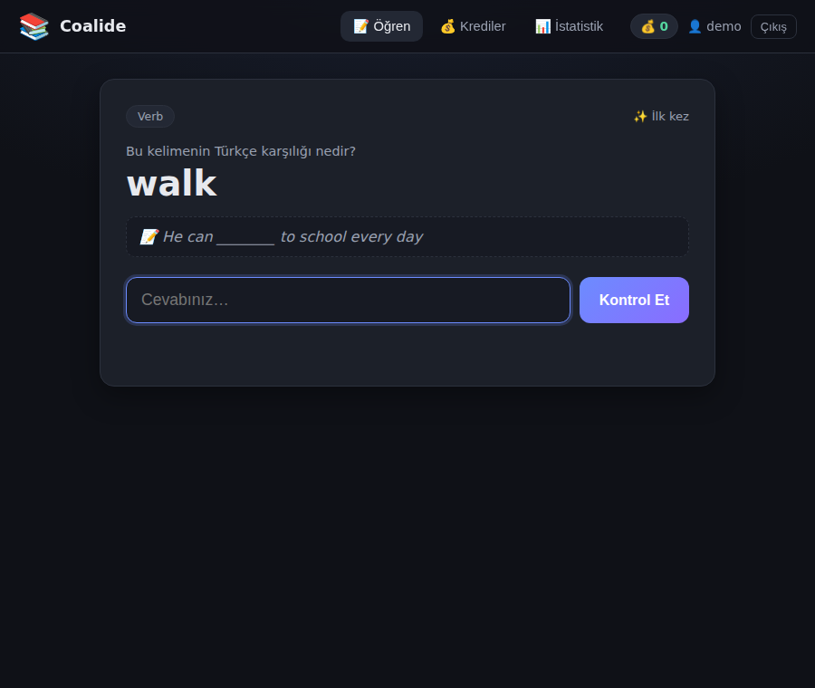
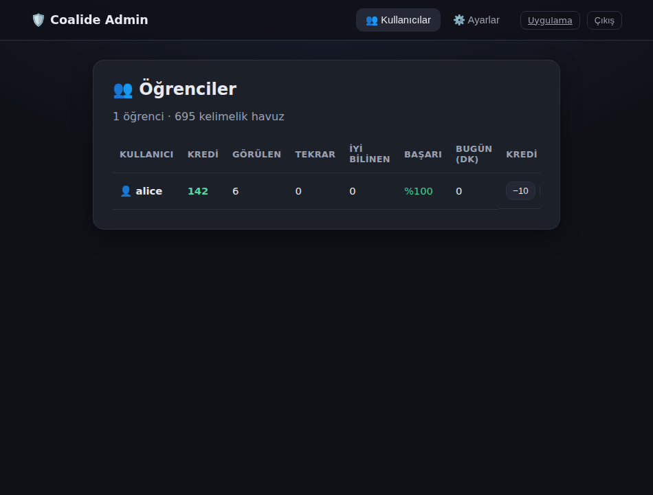

# Coalide — Web App

A browser-based version of the [Coalide](../README.md) spaced-repetition
vocabulary trainer. It reuses the project's vocabulary database
(`../words.json`) and the SM-2 learning core, and wraps them in a Flask backend
with a responsive single-page quiz UI.

Where the original app runs as a terminal (Textual/CLI) program for one machine,
this version runs as a small web server so the trainer can be opened from any
browser, with **per-user progress** kept separately for each learner.



## What's included

- **Same learning engine** — SM-2 scheduling, quality grading (correctness +
  speed), the daily new-word cap, the no-repeat window, bidirectional questions
  and Turkish-aware answer matching are all ported verbatim from the terminal
  app (`sm2.py`, `objects/word_obj.py`), so learning behaves identically.
- **Per-user progress** — each learner logs in with a username; their SM-2 state
  and credit balance live in `webapp/data/<user>_progress.json` and
  `webapp/data/<user>_data.json`. The shared root `progress.json` is never
  touched.
- **Credits & rewards** — correct answers earn credits inside the configured
  earning window, with the same escalating pricing, weekly reset and 24h/day cap
  as the terminal app. See the note on parental controls below.
- **Pronunciation** — the target word and example sentence are read aloud using
  the browser's built-in Web Speech API, so no TTS keys or server-side audio are
  required. (The terminal app's ElevenLabs/gTTS pipeline is not needed here.)
- **Stats dashboard** — words seen, due now, well-known count and overall
  success rate.
- **Admin dashboard** — a password-protected parent panel at `/admin`,
  connected to the web app's own data: see every learner's progress and
  balance, adjust credits, and edit the shared `config.json` from the browser.

## Admin dashboard

Open <http://localhost:6656/admin> (there's also a link on the login page). It's
gated by the same `ADMIN_PASSWORD` the terminal admin uses — read from the
`ADMIN_PASSWORD` environment variable, else the `ADMIN_PASSWORD=` line in the
project's `../.env`, else the placeholder default `0000`. **Set a real password
before exposing the app beyond localhost.**



From the panel a parent can:

- **Users** — list every web-app learner with balance, words seen, words due,
  well-known count, overall success rate and minutes already redeemed today;
  adjust any learner's credits with one click (−10 / +10 / +100).
- **Ayarlar (Settings)** — edit a whitelisted set of config keys (new-word cap,
  no-repeat window, credit pricing/window, spam protection, language labels, …)
  with type-aware inputs and toggles. The *Kapsam* (scope) selector chooses
  whether you're editing the **global** `config.json` (shared with the terminal
  app) or a **specific user's** overlay; overridden keys are flagged *özel*, and
  *Sıfırla* resets a user back to the global config. Changes take effect on the
  learner's next question.

The admin panel is deliberately connected to the web app's **own** per-user data
under `webapp/data/`, so no separate server process is required. (This is
distinct from the terminal project's separate `serverside/` parental server,
which stores pushed snapshots from the terminal client.)

## Running it

```bash
cd webapp
pip install -r requirements.txt
python app.py
```

Then open <http://localhost:6656> and enter a username to start.

### Configuration

Config is read in layers, later winning:

```
built-in defaults  →  ../config.json (shared root)  →  webapp/data/<user>_config.json (per-user)
```

The shared `../config.json` supplies keys like `Daily_New_Word_Cap`,
`No_Repeat_Window`, `Source_Language`, `Target_Language`,
`Credit_Window_Start/End`, `BASE_RATE_PER_MINUTE`, `ESCALATION_PER_HOUR` and
`Credit_Reset_Weekly` (shared with the terminal app). An optional
`CREDITS_PER_CORRECT` key (default `7`) controls the reward per correct answer.

**Per-user config:** any learner can have their own overlay file at
`webapp/data/<user>_config.json` that overrides only the keys it lists; every
other key falls back to `../config.json`. If a user has no such file, they use
`../config.json` unchanged. Manage these from the admin dashboard's **Ayarlar**
tab (pick a user in the *Kapsam* selector) or drop a JSON file in by hand — e.g.
`webapp/data/mert_config.json`:

```json
{ "Daily_New_Word_Cap": 5, "CREDITS_PER_CORRECT": 10 }
```

### `.env`

On startup the app loads the **project-root `../.env`** (the same file the
terminal app uses) into the environment — via `python-dotenv` if installed, else
a minimal built-in parser. So `ADMIN_PASSWORD`, `COALIDE_SECRET_KEY`, `PORT`,
etc. can be set there. Real environment variables always take precedence over
`.env`.

Environment variables:

| Variable | Purpose | Default |
|---|---|---|
| `COALIDE_SECRET_KEY` | Flask session secret — **set this in production** | dev placeholder |
| `PORT` | Port to listen on | `6656` |
| `ADMIN_PASSWORD` | Admin dashboard password (also read from `../.env`) | `0000` |
| `COALIDE_DEBUG` | Set to enable Flask debug mode | off |

## How it maps to the terminal app

| Terminal app | Web app |
|---|---|
| `sm2.get_next_question` / `calculate_quality` / `update_sm2` | `engine.get_next_word` / `calculate_quality` / `apply_result` |
| `objects/word_obj.py` (`Word`, progress) | reuses `Word`; progress persisted per-user in `engine.py` |
| `new_master.normalize_answer` | `engine.normalize_answer` |
| `objects/balance_obj.py` (credits/pricing) | `credits.py` |
| `current_user.json` | Flask session cookie |
| ElevenLabs / gTTS audio | browser Web Speech API |

### A note on parental controls (PCV2)

The terminal app redeems credits by calling a [PCV2](https://github.com/cekirge1972/PCV2)
server on the family LAN to grant real screen time. A web deployment generally
can't reach a device on that private network, so this version records
redemptions locally (applying all the same pricing, caps and weekly-reset rules)
without making the PCV2 call. If you deploy this alongside a reachable PCV2
server, wiring `credits.redeem` to `parental_connection.add_exceptional_time`
would restore the real grant.

## Project layout

```
webapp/
├── app.py            # Flask app: pages + JSON API (quiz + admin)
├── engine.py         # per-user SM-2 learning engine (reuses words.json + Word)
├── credits.py        # per-user credit earning / pricing / redemption
├── requirements.txt
├── templates/
│   ├── login.html
│   ├── index.html    # single-page quiz / rewards / stats UI
│   └── admin.html    # parent admin dashboard (users + settings)
├── static/
│   ├── style.css
│   ├── app.js        # quiz front-end logic
│   └── admin.js      # admin dashboard logic
└── data/             # per-user progress + balances (gitignored)
```

## Production note

`python app.py` uses Flask's development server, which is fine for local/family
use. For a real deployment, run it behind a WSGI server, e.g.:

```bash
pip install gunicorn
gunicorn -w 2 -b 0.0.0.0:6656 app:app
```
